[TOC]

# Web浏览器

## 生成HTTP请求消息

涉及的内容有：

1. 解析地址：包括schema，host，port，directory，file
2. 省略文件名的情况
3. Http相关的方法
4. 生成httpmessage的格式

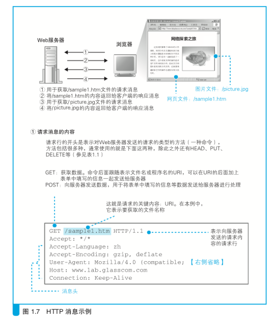

5. 请求消息中主要的头字段
6. 收到的相应状态码

## DNS查询IP地址

### IP相关的知识

子网，广播，掩码，公有私有

> 各个地方的网段？

### 发送请求DNS服务器

1. Socket库中调用解析器，在通过协议栈将请求发送给DNS服务器
2. DNS服务器地址可以通过配置或者默认地址

3. 开始向DNS服务器查询Web服务器的IP地址，通过协议栈UDP协议向DNS服务器查询
4. DNS接收客户端的查询消息：域名，Class（原设计用来识别网络，先只有代表互联网的IN），记录类型（A表示IP地址，MX为邮件服务器）

### DNS服务器的基本工作

1. 域名的层次结构

   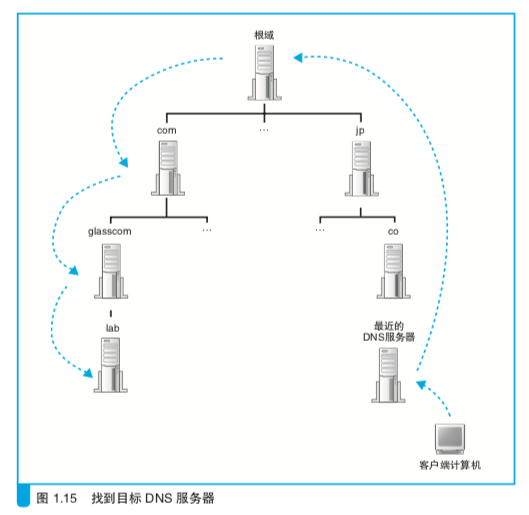

   

   2. DNS服务器间的查询操作

   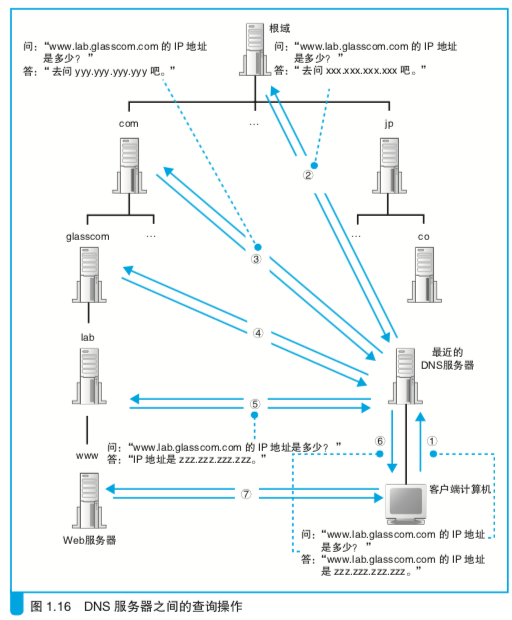

   3. 缓存：缓存有一个有效期，过了有效期后，会被删除

## 发送消息

1. 创建套接字
2. 将管道连接到服务器端的套接字上
3. 收发数据
4. 断开管道并删除套接字

# 协议栈、网卡

## 创建套接字

协议栈：上面的部分会想下面的部分委派工作，下面的部分接收委派的工作并实际执行

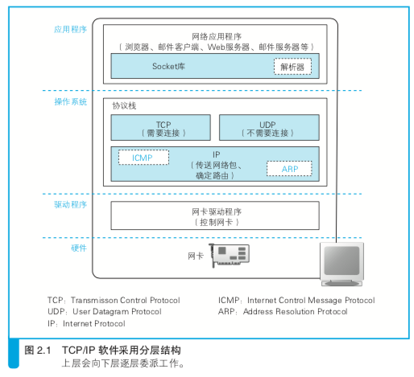

套接字：在协议栈内部有一块用于存放控制信息的内存空间，这里记录了用于控制通信操作的控制信息，例如通信对象的IP地址、端口号、通信操作的进行状态等。协议栈时根据套接字中记录的控制信息来工作的。netstat能打印出套接字，每行相当于一个套接字。

调用socket：协议栈分配用于存放一个套接字所需的内存空间，往里面存入控制信息，然后将套接字的描述符告知运用程序。运用程序收到套接字后，向协议栈委托后续的操作时需要提供这个描述符。

### 连接服务器

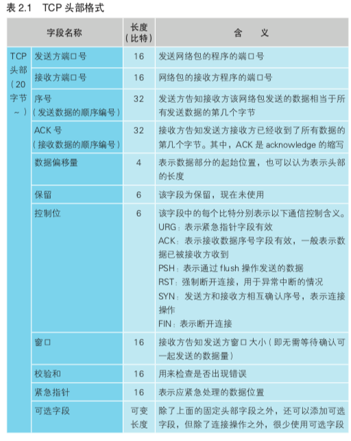

连接实际上是通信双方交换控制信息，在套接字中记录这些必要信息并准备数据收发的一连串操作。在连接阶段，还没有实际的数据，只有控制信息，这些控制信息位于网络包的开头，称为头部，头部信息不仅包括TCP头部，还有以太网头部，IP头部。此外还有一部分控制信息保存在套接字（套接字中的控制信息，因平台不同，协议栈实现方式不同而不同），具体就是netstat打印出来的内容。

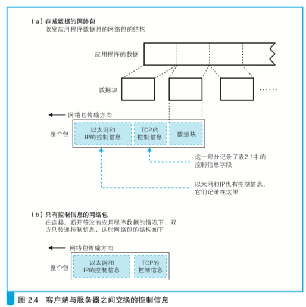

connect(<描述符>, <服务器IP和Port>, ...)

上面的调用包括下面几个步骤：

1. 客户端先把传递进来的服务器IP和Port传递给协议栈的TCP模块，创建一个包含表示开始数据收发操作的控制信息的头部：TCP头部的控制位的SYN置为1；TCP头部的序号和窗口大小（序号为一个随机值，用于收发数据过程中确认接收方是否接收到数据包）
2. TCP模块将信息传递给IP模块并委托它进行发送。IP模块执行网络包发送操作后通过网络到达服务器
3. 服务器上的IP模块将接收到的数据传递给TCP模块
4. 服务器上的TCP模块在TCP头部中设置发送方和接收方端口号；设置SYNC比特；设置ACK控制位；设置ACK号<!--因为还没有传输数据，这个ACK号可能就等于客户端传过来的序号-->。
5. 服务器TCP模块会将TCP头部传递给IP模块，IP模块向客户端返回响应，网络包返回客户端，通过IP模块达到TCP模块
6. 客户端通过TCP头部的信息确认连接服务器的操作是否成功，如果SYN置上，会向**套接字**中写入服务器的IP地址、端口号等信息，同时套接字中的状态改为连接完毕。此外将ACK比特置为1，设置ACK号，发回给服务器<!--因为还没有传输数据，这个ACK号可能就等于服务器传过来的序号-->。

### 收发数据

write函数

- 协议栈接收到应用程序传来的数据，将数据存放在内部的发送缓冲区，并等待应用程序的下一段数据（有些应用程序会逐字节或逐行传递数据）；协议栈会根据**MTU参数**和**时间**。TCP和IP的头部加起来一般是40字节，因此MTU减去这个长度就是MSS，例如在以太网中，MTU为1500，因此MSS就是1460，TCP/IP可以使用一些可选参数，如加密，这时候头部长度增加，MSS就会减小）；协议栈内部有一个计时器，当经过一定时间之后，会把网络包发送出去，这个时间也不是固定值，而是根据ACK号返回所需时间动态调整（<!--见后续操作有关ACK号的作用-->）

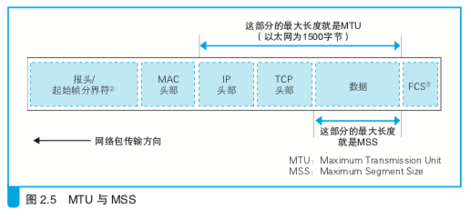

- 如果发送缓冲区中的数据超过MSS，发送缓冲区会以MSS长度为单位进行拆分

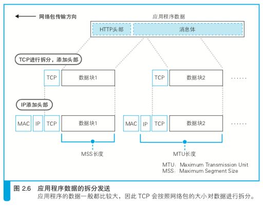

- 通过序号和ACK号确认接收方是否收到了网络包（这里只是将需要和ACK号单独拎出来讲，实际上，滑动窗口和ACK号与窗口的合并并没有在这里体现）

  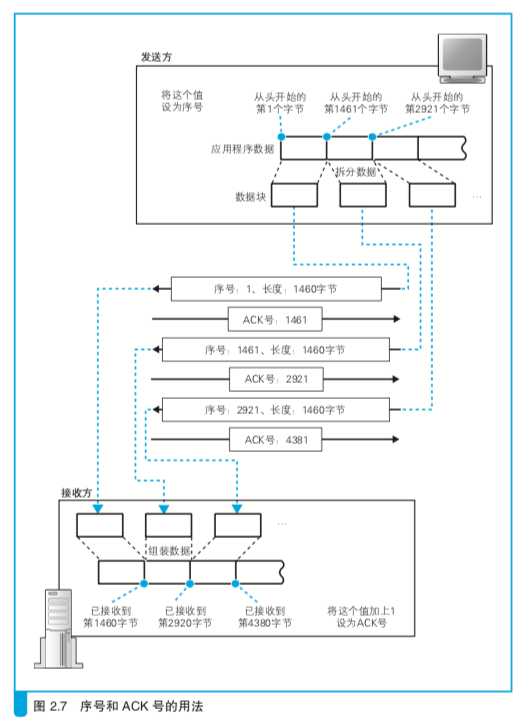

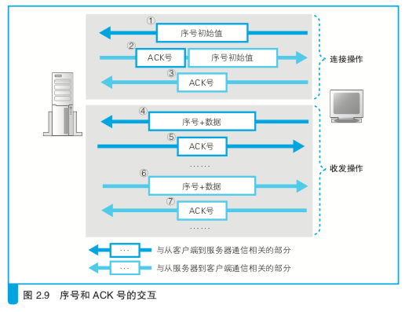

- 滑动窗口

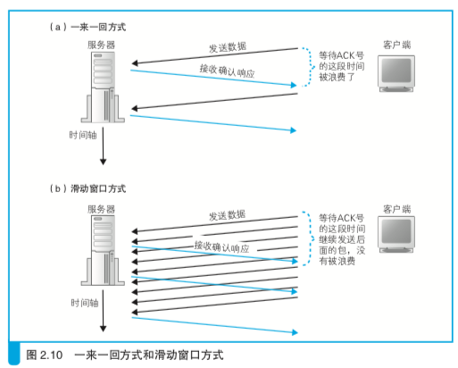

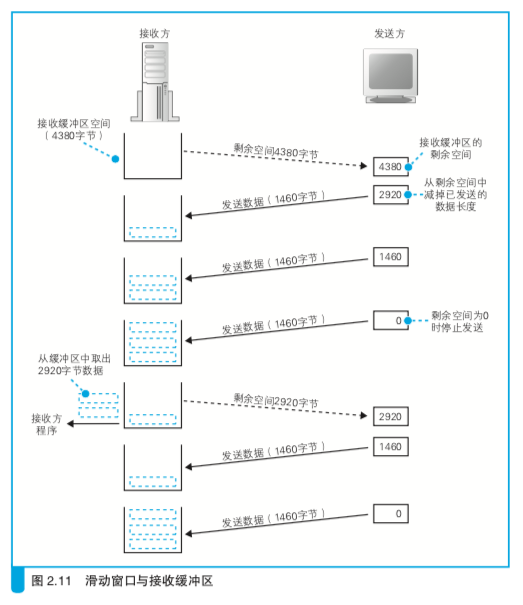

- 窗口和ACK的合并

从数据的角度分析，当接收方接收到数据操作完成后就应该向发送发返回ACK号，表示数据已经收到；而窗口的更新应该是在数据传递给应用程序之后，缓冲区大小增大才需要更新窗口大小。但这样每收到一个包，需要分别返回发送ACK号和窗口更新的两个包，会导致网络速率下降。因此接收方在发送ACK号和窗口更新时，并不会马上把包发送出去，而是会等待一段时间，在这个过程中很有可能会出现其他的通知操作，这样就可以把两种通知合并在一个包里面发送了。多个ACK号的包可以合并发送最后一个ACK号，多个窗口更新的包也可以合并发送最新的接收缓冲区的剩余空间，ACK号包和窗口更新的包也可以合并，因为可以写在一个包的不同位置上。

- 接收消息

浏览器在委托协议栈发送请求消息之后，会调用read程序来获取响应消息，然后控制流程会通过read转移到协议栈，然后协议栈会执行接下来的操作。响应消息的返回还需要等待一段时间，因此这时接收缓冲区中还没有数据，这时，协议栈会将应用程序暂时挂起，等服务器返回的响应消息到达之后恢复执行接收操作

### 从服务器断开并删除套接字

在HTTP1.0中，一个请求发送到web服务器，web服务器返回响应消息，服务器一方会发起断开过程；在HTTP1.1中，服务器返回响应消息之后，客户端还可以继续发起下一个请求消息，如果没有请求要发送了，客户端一方会发起断开过程（Connection: keep-alive，默认开启，除非Connection: close）；这里假设服务器发起断开，调用Socket库中的close程序。

服务器的协议栈会生成包含断开信息的TCP头部，将控制位的FIN置为1。接下来，协议栈会委托IP模块向客户端发送数据，同时服务器的套接字中也会记录下断开操作的相关信息。

客户端收到服务器发来的FIN为1的TCP头部时，客户端的协议栈会将自己的**套接字**标记为断开状态。然后向服务器返回一个ACK号。这些操作完成后，协议栈就可以等待应用程序来取数据了。应用程序调用read，接收缓冲区如果有数据，依然会传递数据给应用程序，如果没有，也不会挂起应用程序，而是告知应用程序来自服务器的数据已经全部收到。客户端也会调用colse来结束数据收发操作，这时客户端的协议栈和服务器一样，生成一个FIN控制位为1的TCP包，委托IP模块发送给服务器，一段时间后服务器返回ACK号。到这里，通信结束。

断开的操作顺序如下：

1. 服务器发送FIN
2. 客户端返回ACK号
3. 客户端发送FIN
4. 服务器返回ACK号

通信结束后，并不会理解删除套接字，而是会等待一段时间之后再删除。等待主要是为了防止误操作。等待的时候与包重传的操作方式有关，一般来说会等待几分钟后再删除。

> 举个误操作的例子，假设由客户端发起断开操作，第4步，客户端返回ACK号丢失了，服务器没有收到ACK号，可能重发一次FIN。如果这时客户端的套接字已经删除了，对应的端口号就会被释放出来，如果有别的应用程序刚好创建套接字用了同一个端口号，而客户端的FIN正好到达，本来这个FIN是发给之前的套接字的，但这时候可能会发给新套接字，执行断开操作（其实这里巧合比较多，端口号释放后并不会立即被分配出去，除非指定；服务器不会有这种巧合，因为服务器不仅通过端口号识别套接字，还通过客户端的IP和端口）

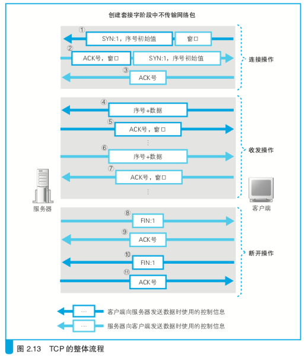

## IP与以太网的包收发操作

### 包基础

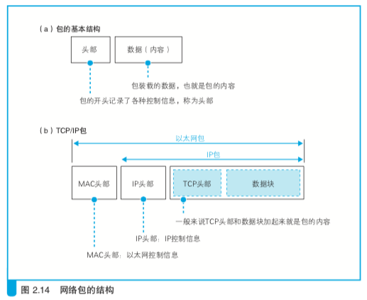

网络分工：

- 路由器根据目标地址判断下一个路由器的位置（IP协议根据目标地址判断下一个IP转发设备的位置）<!--IP头部-->
- 集线器在子网中将网络包传输到下一个路由器（子网中的以太网协议将包传输到下一个转发设备）<!--MAC头部-->
- IP模块负责添加两个头部： MAC头部（以太网用）；IP头部（IP用的头部）

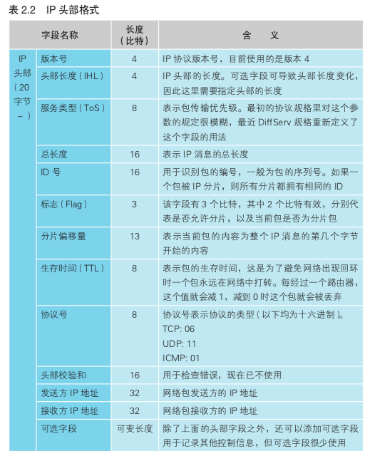

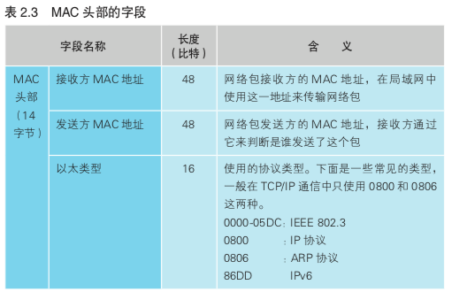

### 通过ARP查询目标路由器的MAC地址

在以太网中有一种叫做广播的方法，可以把包发给连接在同一以太网中的所有设备。ARP就是利用广播：

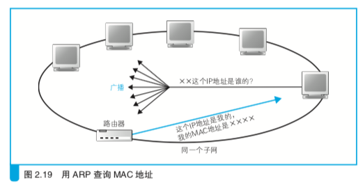

如果对方和自己处于同一个子网中，那么通过上面的操作就可以得到对方的MAC地址。然后，我们将这个MAC地址写入MAC头部，MAC头部就完成了。

ARP也会有缓存，删除策略就是过了几分钟强制删除：

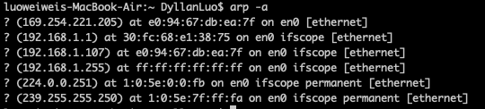

> MAC头部虽然是以太网需要的内容，但是打包MAC头部是IP模块负责的，让IP负责整个打包工作是有利的。如果在交给网卡之前，IP模块能够完成整个打包工作，那么网卡只要将打好的包发送出去就可以了。对于除IP以外的其他类型的包也是一样，如果在交给网卡之前完成打包，那么对于网卡来说，发送的操作和发送IP包是完全相同的。这样一来，同一块网卡就可以支持各种类型的包

### 以太网

- 将包发送到MAC头部的接收方MAC地址代表的目的地
- 用发送方MAC地址识别发送方
- 用以太类型识别包的内容

网卡并不是通电之后就能立马工作，而是和其他的硬件一样，都需要进行初始化。即启动操作系统后，网卡驱动程序会对硬件进行初始化操作，然后硬件才进入可使用状态。这些操作包括硬件错误检查，初始设置等。

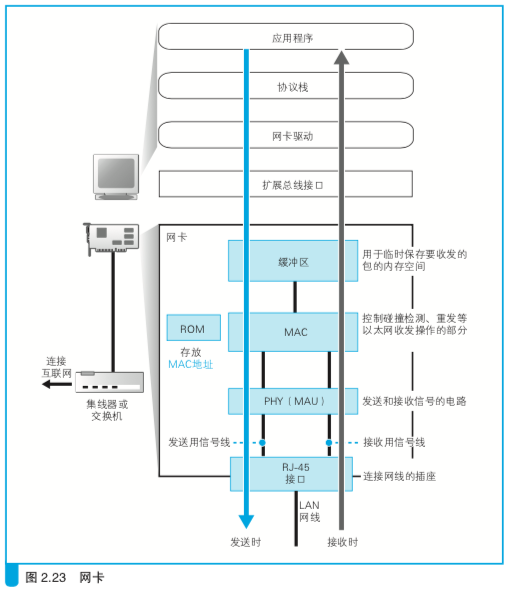

网卡ROM是在生产网卡时写入全世界唯一的MAC地址，驱动程序读出这个值之后就可以对MAC模块进行设置MAC值，有的驱动也支持从命令或者配置文件中读取MAC地址并分配给MAC模块。

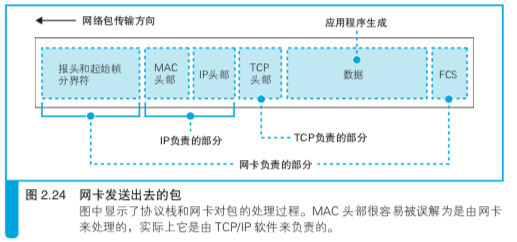

### 向集线器发送网络包

以太网中信号方式：

- MAU Medium Attachment Unit，介质连接单元
- PHY Pyhsical Layer Device，物理层装置，在速率100Mbit/s以上的以太网中都叫PHY

发送信号操作分两种：

- 使用集线器的半双工模式
- 使用交换机的全双工模式

### 接收网络包

首先PHY(MAU)模块先开始工作，然后MAC模块。PHY会将信号转换成通用格式并发送给MAC模块，MAC模块再从头开始将信号转换为数字信息，并存放缓冲区，当到达信号的末尾时，还需要检查FCS。如果FCS没有问题，接下来检查MAC头部中接收方MAC地址与网卡在初始化时分配给自己的MAC地址是否一致，以判断这个包是不是发给自己的。如果不是就直接丢弃（混杂模式PromiscuousMode下网卡不检查包的接收方地址，直接接收），否则放入缓冲区。接下来网卡会通知计算机收到一个包，激发中断机制

> 中断的过程：网卡向扩展总线中的中断信号线发送信号，该信号线通过计算机中的中断控制器连接到CPU。当产生中断信号时，CPU会暂时挂起正在处理的任务，切换到操作系统中的中断处理程序。然后中断处理程序会调用网卡驱动，控制网卡执行相应的接收操作。中断是有编号的。网卡在安装的时候就在硬件中设置了中断号，在中断处理程序中则将硬件的中断号和响应的驱动程序绑定。

网卡驱动被中断处理程序调用后，会从网卡的缓冲区中取出收到的包，并通过MAC头部中的以太类型字段判断协议的类型。现在我们在大多数情况下都是使用TCP/IP协议，0x0080代表IP协议，但也有其他类型的协议，如NetWare中使用IPX/SPX，Mac中使用AppTalk等0x809B代表AppleTalk协议。

### 响应包从IP传递给TCP

第一步检查IP头部，如果格式没有问题，下一步就是查看接收方IP地址，如果接收网络包的接收方IP与客户端网卡的地址一致，就可以接收这个包了。如果不一致，客户端计算机不负责对包进行转发（服务器的操作系统具备路由器相同的包转发功能，当打开这一功能时，会对包进行转发），IP模块会通过ICMP消息将错误告知发送方。

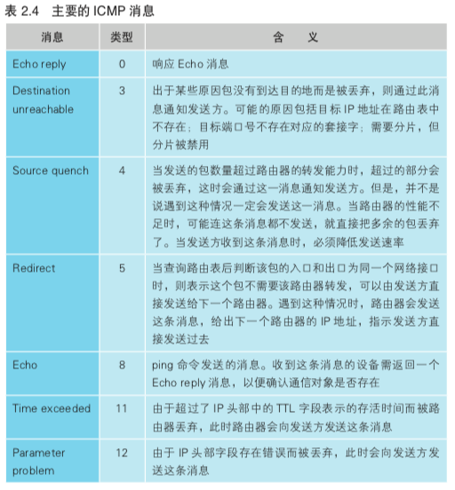

如果接收方IP地址正确，IP模块还会把分片过的小包还原成原始的包。分片的包会在IP头部的标志字段中进行标记，还有一个分片偏移量和总长度，根据这些信息，IP模块先将收到的分片包暂存在内部的内存空间，等待IP头部中具有相同ID的包全部到达后还原。

## UDP协议的收发操作

UDP没有TCP的接收确认、窗口等机制，因此在收发数据之前也不需要交换控制信息，不需要建立和断开连接的步骤，只要从应用昌旭获取的数据前面加上UDP头部，然后交给IP进行发送就可以了。接收也简单，根据IP头部的接收方和发送方IP地址，以及UDP头部的接收方和发送方的端口号，找到相应的套接字并将数据交给响应的程序就可以了。除此之外，UDP协议没有其他功能，遇到错误或者丢包也一概不管。

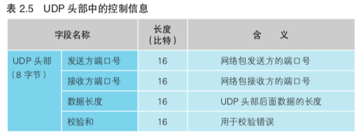

# 集线器、交换机、路由器

这里略过集线器和交换机，重点说下路由器。

## 路由器

### 路由表

完成包接收操作之后，路由器就会丢弃包开头的MAC头部。MAC头部的作用就是将包送达路由器，其中的接收方MAC地址就是路由器端口的MAC地址，于是包到达路由器之后MAC头部的任务就完成了，MAC头部就会被丢弃。

接下来，路由器根据MAC头部后方的IP头部中内容进行包的转发操作。首先根据路由表判断转发目标。

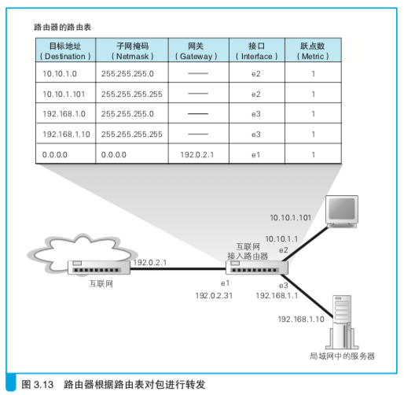

假设地址为10.10.1.101的计算机向地址192.168.1.10的服务器发送一个包，能匹配到上图中的3，4，5行。其中路由器根据网络号比特数最长的那条记录。如果遇到网络号长度相同，就会考虑跃点数值小的记录。

上图最后一条记录子网掩码为0.0.0.0表示默认路由，这一条网关会填写接入互联网的路由器地址，当匹配不到其他路由时，网络包就会转发到互联网接入器路由器。

### 包的有效期

从路由表中查到转发目标后，网络包就会被转交给输出端口，并最终发送出去，通过更新IP头部的TTL字段，每经过一个路由器就减1，当这个值变为0，表示超过有效期，这个包就丢弃，这一机制是为了防止包在一个地方陷入死循环。

### 拆分网络包

路由器也支持IP包的拆分，以适应转发端口的MTU。

<!--为什么TCP和IP模块都需要支持包的拆分呢？也就是协议栈中TCP模块和路由器的IP转发过程会进行包的拆分？这里的拆分跟TCP拆分不一样，TCP是当发现数据超过MSS大小，就把数据给拆分掉了，数据的拆分和整合是通过TCP头部序号和ACK号来控制的（通过序号和ACK号知道数据的顺序）当然TCP对数据进行拆分并不仅仅为了能在一个包内以太网和通信线路中传输，因为这一点IP也能做到，更主要的是为了防止丢包而设计的；IP对包进行拆分，包的拆分和整合是通过IP头部的分片偏移量和总长控制的；另外像UDP就不对数据包进行拆分，所以UDP可发送数据的最大长度为IP包的最大长度减去IP头部和UDP头部长度-->

在分片之前也要确认是否可以分片，如果发送方应用程序等设置了不允许分片，或者这个包是分片后的包，那么就不能分，就只能丢弃这个包，并通过ICMP消息通知发送方。否则根据输出端口MTU对数据依次拆分。

### 路由器的附加功能

- 地址转换
- 包过滤

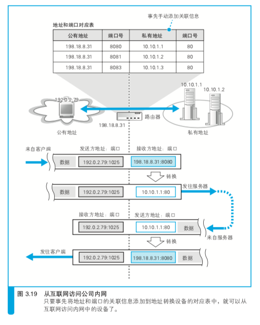

# 接入网、网络运营商

略

# 防火墙、缓存服务器

## 如何设置包过滤的规则

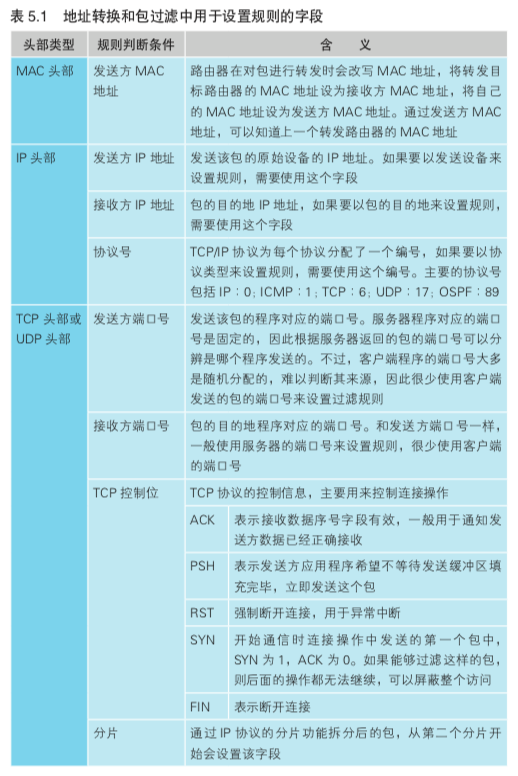

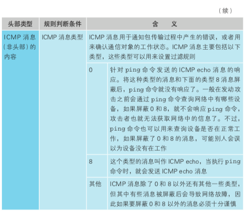

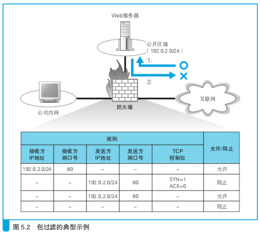

## 平衡负载

### DNS服务器

通过给特定域名分配多个IP地址，例如www.lab.com，分配三个IP：

192.0.2.60

192.0.2.70

192.0.2.80

第一次查询这个域名时，服务器返回如下：

192.0.0.60 192.0.2.70 192.0.2.80

第二次查询这个域名时，服务器返回：

192.0.2.70 192.0.0.60 192.0.2.80

第三次：

192.0.2.80 192.0.0.60 192.0.2.70

这种方式称为轮询（round-robin），缺点时，通过这种方式，假设多台web服务器中有一台出现了故障，我们希望在返回IP地址时能够跳过故障的Web服务器，然而普通的DNS服务器并不能确认Web服务器是否正常工作。另外还有session的跨平台问题。

### 使用负载均衡器分配

nginx或者Fabio等软件也支持，硬件有F5等设备

### 使用缓存服务器分担负载

服务器端的缓存服务器或者Nginx Fabio都是利用反向代理

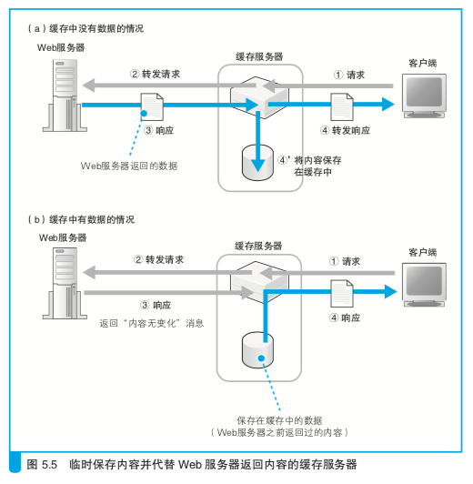

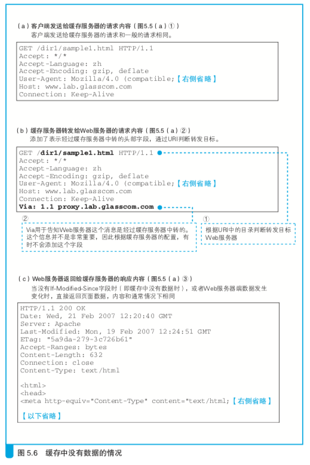

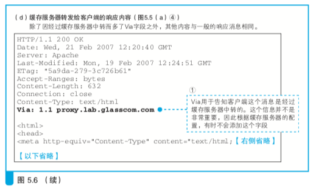

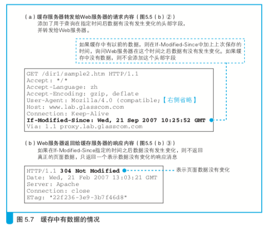

### 正向代理

正向代理不仅有缓存的作用，还可以用来实现防火墙

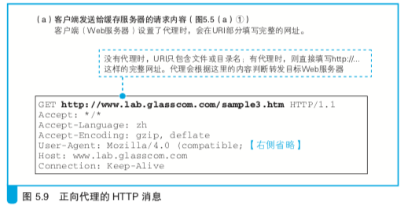

# Web 服务器

- 等待连接模块 当服务器程序启动并读取配置文件完成初始化操作后，就会运行等待连接模块。这个模块会创建套接字，然后进入等待连接的暂停状态，当客户端发起连接时，这个模块恢复运行并接收连接，然后启动客户端通信模块，并移交完成连接的套接字
- 负责和客户端通信的模块 使用已连接的套接字与客户端进行通信，通信结束后，这个模块就退出了

客户端的收发：

1. 创建套接字 
2. 使用管道连接服务器的套接字 连接阶段
3. 收发数据 收发阶段
4. 断开管道并删除套接字 断开阶段

服务器端的收发：

1. 创建套接字 协议栈调用socket创建套接字
2. 将套接字设置为等待连接状态 调用bind将端口号写入套接字，在客户端发起连接的操作中，需要指定服务器端的端口
3. 接收连接 调用accpept来接收连接，如果包没有到达，为block状态；如果包到达，就会接收接连操作，协议栈会给等待连接的套接字复制一个副本，然后将连接对象等控制信息写入副本中，这里就创建了一个新的套接字。原来处于等待连接状态的套接字还会以等待连接的状态继续存在，当再次调用accept，客户端连接包到达后，它又可以再次执行接收连接操作
4. 收发数据
5. 断开管道并删除套接字

此外创建套接字时端口号也是一个关键点，端口号是用来识别套接字的，但这里还需要使用客户端的端口号和IP地址总共四个信息来进行判断套接字：

- 客户端的IP地址
- 客户端的端口号
- 服务器IP地址
- 服务器的端口号

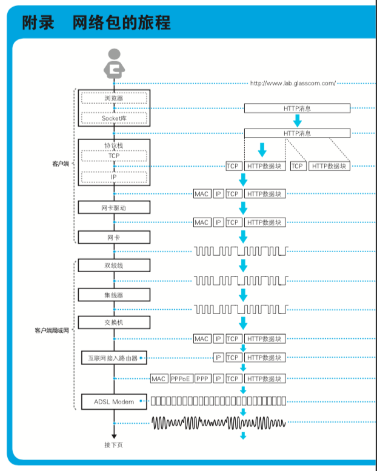

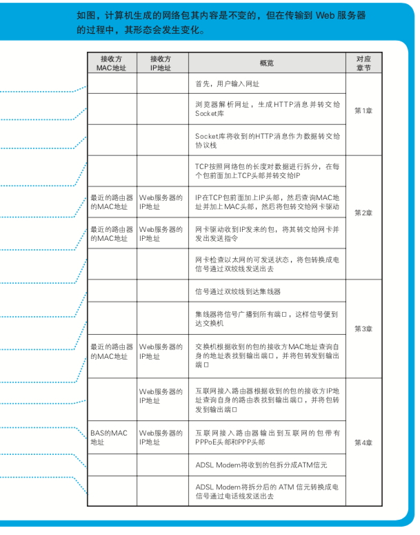

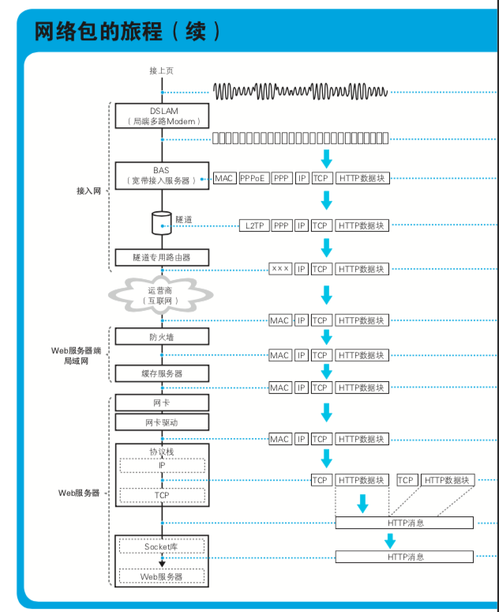

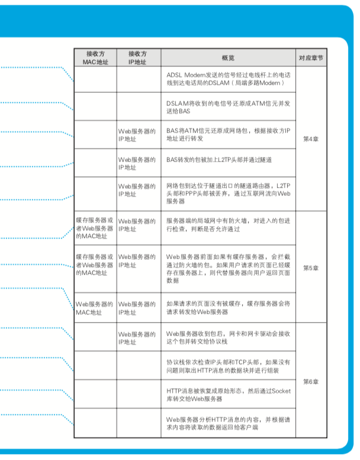

