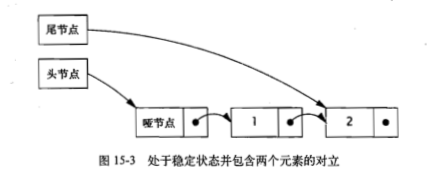
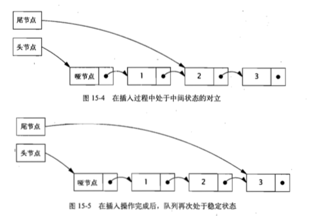

# 基础

## 线程安全

如果多个线程访问同一个可变的状态变量时没有使用合适的同步，那么程序就会出现错误。有三种方式可以修复这个问题：

1. 不再线程之间共享该状态变量
2. 将状态变量修改为不可变的变量
3. 在访问状态变量时使用同步

当设计线程安全的类时，良好的面向对象技术，不可修改性，以及明晰的不变性规范都能起到一定的帮助。

> A class is thread‐safe if it behaves correctly when accessed from multiple threads, regardless of the scheduling or interleaving of the execution of those threads by the runtime environment, and with no additional synchronization or other coordination on the part of the calling code.

### 原子性

#### 竟态条件

- Check-Then-Act
- Read-Modify-Write

## 对象的共享

- 可见行：主要指内存可见行，同步或者Volatile变量
- 发布(Publish)与逸出(Escape)：不要在构造函数中引用逸出，可以通过工厂方法防止this引用在构造函数中逸出
- 线程封闭：如果仅在单线程内访问数据，就不需要同步，这种方式叫做线程封闭(Thread Confinement)
- Ad-hoc线程封闭：维护线程封闭性的职责完全由程序实现来承担
- 栈封闭：只有通过局部变量才能访问对象
- ThreadLocal类
- 不变性：对象创建后其状态不能修改；所有域都是final类型（技术上说，不可变对象并不需要将所有的域都声明为final，例如String的hash field，这需要对类的良性数据竞争(Benign Data Race)情况做精确分析。因此需要深入理解Java内存模型。String会将散列值的计算推迟到第一次调用hashcode，并讲计算得到的值缓存到非final类型的域中，但这种方式之所以可行，是因为这个域有一个非默认值，并且每次计算中都得到相同的结果）；对象是正确创建的没有逸出。不可变对象一定是线程安全的
- final域：在Java内存模型中，final域能确保初始化过程的安全性，从而可以不受限制的访问不可变对象，并在共享这些对象时无需同步

### 安全发布

- 在静态初始化函数中初始化一个对象引用
- 将对象的引用保存到volatile类型的域或者AtmicReference对象中
- 将对象的引用保存在某个正确构造对象的final类型域中
- 将对象的引用保存在一个由锁保护的域中

## 对象的组合

#### 设计线程安全的类

- 找出构成对象状态的所有变量
- 找出约束状态变量的不变性条件
- 建立对象状态的并发访问管理策略

同步策略：定义了如何在不违背对象不变条件或后验条件的情况下对其状态的访问操作进行协同。还规定了如何将不可变性、线程封闭、与加锁机制等结合起来以维护线程安全性，哪些变量由哪些锁来保护。要确保开发人员可以对这个类进行分析和维护，同时写为正式文档.

## 基础构建模块

### 并发容器

Java5提供了多种并发容器类来改进同步容器的性能。同步容器将所有对容器状态的访问都串行化。在新的ConcurrentMap接口中增加了对一些常见复合操作的支持，例如putIfAbsent, remove(Key, Value), replace(Key, OldValue, NewValue), replace(Key, newValue)。

Java5增加了两种新的容器类型：Queue和BlockingQueue

Java6引入了ConcurrentSkipListMap和ConcurrentSkipListSet 分别作为同步的SortedMap和SortedSet的并发替代品

### ConcurrentHashMap

ConcurrentHashMap并不是将每个方法都在同一个锁上同步并使得每次每次只有一个线程访问容器，而是使用一种粒度更细的加锁机制来实现更大程度的共享，这种机制称为分段锁（Lock Striping）。在这种机制中，任意数量的读取线程可以并发的访问Map，执行读取操作的线程和执行写入操作的线程可以并发地访问Map，并且一定数量的写入线程可以并发地修改Map。

ConcurrentHashMap与其他并发容器都增强了同步容器类：提供的迭代器不会抛出ConcurrentModificationException，因此不需要在迭代过程中对容器加锁。ConcurrentHashMap返回的迭代器具有弱一致性，弱一致性的迭代器可以容忍并发的修改，当创建迭代器时会遍历已有的元素，并可以（但不保证）在迭代器被构造后将修改操作反映给容器。

ConcurrentHashMap的size和isEmpty方法，是一个估计值，因为返回的结果在计算时可能已经过期。

### CopyOnWriteArrayList

在每次修改时，都会创建并重新发布一个新的容器副本。

### 阻塞队列和生产者-消费者模式

阻塞队列提供可阻塞的put和take方法，以及支持定时的offer和poll方法。如果队列已经满了，那么put方法将阻塞直到有空间可用；如果队列为空，那么take方法会阻塞直到有元素可用。队列可以是有界的或者无界的，无界队列永远不会充满，因此无界队列的put方法不会阻塞。

BlockingQueue简化了生产者-消费者设计的实现过程，它支持任意数量的生产者和消费者。一种最常见的生产者-消费者设计模式就是线程池与工作队列的组合，在Executor任务执行框架中就体现了这种模式。

LinkedBlockingQueue, ArrayBlockingQueue是FIFO队列, PriorityBlockingQueue.

SynchronousQueue实际上不是一个真正的队列，因为它不会为队列中元素维护存储空间，所以put和take会一直阻塞，直到有另一个线程已经准备好参与到交付过程中。仅当有足够多的消费者，并且总是有一个消费者准备好获取交付的工作时，才适合使用同步队列。

Java6增加了两种容器类型，Deque和BlockingDeque，实现了队列头和队列尾的高效插入和移除。正如BlockingQueue适用于生产者-消费者模式，BlockingDeque适用于Work Stealing模式，在生产者-消费者设计中，所有消费者有一个共享的工作队列，而WorkStealing的设计中，每个消费者都有各自的双端队列，如果一个消费者完成了自己的双端队列中的全部工作，那么它可以从其他消费者双端队列末尾获取工作。WorkStealing比生产者-消费者模式具有更高的可伸缩性，这时因为工作者线程不会在单个共享任务队列上发生竞争。在大多数时候，它们只是访问自己的双端队列，从而极大减少了竞争。当工作者线程需要访问另一个队列时，它会从队列的尾部而不是从头部获取工作，因此进一步降低队列上的竞争程度。

### 阻塞方法和中断方法

线程可能会阻塞或暂停执行，原因有多种：等待IO操作结束，等待获得一个锁，等待从sleep方法醒来，等待另一个线程的计算结果。当线程阻塞时，它通常被挂起，并处于某种阻塞状态（BLOCKED, WAITING, TIMED_WAITING）。阻塞操作与执行时间很长的普通操作的差别在于被阻塞的线程必须等待某个不受它控制的事件发生后才能继续执行。

BlockingQueue的put和take会抛出InterruptedException，表示该方法是一个阻塞方法。

Thread提供了interrupt方法，用于中断线程或者查询线程是否已经被中断。每个线程都有一个bool属性，标志线程的中断状态，当中断线程时设置这个状态。

中断是一种协作机制，一个线程不能强制其他线程停止正在执行的操作而去执行其他的操作，当线程A中断B时，A仅仅是要求B在执行到某个可以暂停的地方停止正在执行的操作——前提是B愿意停止下来。

当在代码中调用了一个将抛出InterruptedException异常的方法时，你自己的方法也就变沉恶搞了一个阻塞方法，并且需要处理对中断的响应，有两种基本选择：

1. 传递InterruptedException，传递给方法的调用者
2. 恢复中断：Thread.currentThread().interrupt()<!--将线程的interrupt flag置上-->

### 同步工具类

阻塞队列可以作为同步工具类，其他类型的同步工具还有信号量(Semaphore)、栅栏(Barrier)以及闭锁(Latch)

- 闭锁 相当于一扇门，到达结束状态之前，这扇门一直时关闭的，并且没有任何线程能通过，当到达结束状态时，这扇门会打开并允许所有线程通过。当到达结束状态后，将不会在改变状态，永远保持打开状态
- FutureTask 也可以用作闭锁，实现了Future，表示一种抽象的可生成结果的计算。有三种状态：等待运行(Waiting to run), 正在运行(Running), 运行完成(Completed)。
- 信号量
- 栅栏 类似于闭锁，它能阻塞一组线程直到某个事件发生。栅栏与闭锁的区别在于，所有线程必须同时到达栅栏位置，才能继续执行。闭锁用于等待事件，而栅栏用于等待其他线程。CyclicBarrier可以使一定数量的参与方反复地在栅栏位置汇集，它在并行迭代算法中非常有用：这种算法通常将一个问题拆分成一系列相互独立的子问题。当线程到达栅栏位置时将调用await方法，这个方法将阻塞直到所有线程都到达栅栏位置。如果所有线程都到达栅栏位置，那么栅栏将打开，此时所有线程都被释放，而栅栏将被重置以便下次使用。如果对await的调用超时，或者await阻塞的线程被中断，那么栅栏就被认为是打破了，所有阻塞的await调用都将终止并抛出BrokenBarrierException。如果成功通过栅栏，那么await将为每个线程返回一个唯一的到达索引号，我们可以利用这些索引来"选举"产生一个领导线程，并在下一次迭代中由该领导线程执行一些特殊的工作。CyclicBarrier还可以将一个栅栏操作(Runnable)传递给构造函数，当成功通过栅栏时会在一个子任务线程中执行它，但在阻塞线程被释放之前时不能执行的。另一种形式的栅栏时Exchanger，它是一种两方(Two-Party)栅栏，各方在栅栏位置上交换数据。当两方执行不对称操作时，Exchanger会非常有用。例如当一个线程向缓冲区写入数据，而另一个线程从缓冲区中读取数据。这些线程可以使用Exchange来汇合，并将满的缓冲区与空的缓冲区交换。当两个线程通过Exchange交换对象时，这种交换就把这两个对象安全的发布给另一方。数据交换的时机取决于应用程序的响应需要，一般的策略都是当缓冲区被填满时进行交换，缓冲区没填满，但是过了一定时间，也进行交换。 

> 在不涉及IO操作或共享数据访问的计算问题中，当线程数量为$N_{cpu}$或$N_{cpu+1}$时将获得最优的吞吐量。

# 结构化并发应用程序

## 任务执行

### Executor框架

执行策略：通过将任务的提交与执行解耦开来，从而无须太大的困难就可以为某种类型的任务指定和修改执行策略，在执行策略中定义了任务执行的"What, Where, When How"等方面

- 在什么(what)线程中执行任务
- 任务按照什么顺序执行(FIFO, LIFO, 优先级)
- 有多少个任务能并发执行
- 在队列中有多少个任务在等待执行
- 如果系统由于过载需要拒绝一个任务，那么应该选择哪一个任务？另外，如何通知应用程序有任务被拒绝？
- 在执行一个任务之前或之后，应该进行哪些操作？

ExecutorService扩展了Executor接口，添加了一些用于生命周期管理的办法。生命周期状态有三种：运行、关闭和已终止。ExecutorService在初始创建时处于运行状态。shutdown方法将执行平缓的关闭过程：不再接收新的任务，同时等待已经提交的任务执行完成——包括哪些还未开始执行的任务。shutdownNow方法将执行粗暴的关闭过程：它将尝试取消所有运行中的任务，并且不再启动队列中尚未开始执行的任务。

在ExecutorService关闭后提交的任务将由RejectedExecutionHandler来处理，等所有任务都完成后，ExecutorService将转入终止状态。可以调用awaitTermination来等待ExecutorService到达终止状态，或者通过调用isTerminated来轮询ExecutorService是否已经终止。通常在调用awaitTermination之后立即调用shutdown，从而产生同步的关闭ExecutorService的效果。

CompletionService：如果向Executor提交了一组计算任务，并且希望在计算完成后获得结果，那么可以保留与每个任务关联的Future，通过反复调用get timeout为0的方法轮询得到所有任务是否完成。这种情况可以使用CompletionService，可以将Callable任务提交给它执行，然后使用类似于队列操作的take和poll等方法获得已完成的结构，这些结果会在完成时被封装成Future。ExecutorCompletionService实现了CompletionService，在构造函数中创建了一个BlockingQueue来保存计算完成的结果，当计算完成时，调用Future-Task中的done方法。当提交某个任务时，该任务将首先包装成一个QueueingFuture，这个Future改写了done方法，将结果放入BlockingQueue中，take和poll方法委托给了这个BlockingQueue

## 取消和关闭

每个线程都有一个boolean类型的中断状态。当中断线程时，这个线程的中断状态将被设置为true。在Thread中包含了中断线程以及查询线程中断状态的方法：interrupt方法能中断目标线程，isInterrrupted方法返回目标线程的中断状态，静态的interrupted方法清楚当前线程的中断状态，并返回它之前的值，这也是清除中断状态的额唯一方法。调用interrupt并不意味着立即停止目标线程正在进行的工作，而只是传递了请求中断的消息。

> 中断操作：它并不会真正的中断一个正在运行的线程，而只是发出中断请求，然后由线程在下一个合适的时刻中断自己。（这些时刻也被称为取消点）。有些方法例如wait, sleep, join等，将严格的处理这种请求，当它们收到中断请求或者在开始执行时发现某个已被设置好的中断状态时，将抛出一个异常。

**不可中断的阻塞**：

- Java.io包中的同步Socket I/O，InputStream和OutputStream中的read和write等方法都不会响应中断，但通过关闭底层的套接字，可以使得由于执行read和write等方法而被阻塞的线程抛出一个SocketException
- Java.io包中的同步I/O，当中断一个正在InterruptibleChannel上等待的线程时，将抛出ClosedByInterruptException并关闭链路（这还会使得其他在这条链路上阻塞的线程同样抛出ClosedByInterruptException）。当关闭一个InterruptibleChannel时，将导致所有在链路操作上阻塞的线程都抛出AsynchronousCloseException。大多数标准的Channel都实现了InterrutibleChannel
- Selector的异步I/O，如果一个线程在调用Selector.select方法时阻塞了，调用close或wakeup会使线程抛出ClosedSelectorException并提前返回
- 获取某个锁。如果一个线程由于等待某个内置锁而阻塞，那么将无法响应中断。Locker类提供了lockInterruptibly方法允许在等待一个锁的同时仍能响应中断。

**毒丸对象**：一个特殊的对象用来结束生产者——消费者模式，在FIFO队列中，毒丸对戏那个确保消费者在关闭前完成队列中所有工作。确定消费者的个数

**InvokeAll**：利用ExecutorService，把所有的task都queue进去，然后调用shutdown方法，接着调用awaitTermination。

**未捕获异常**：在Thread API中提供了UncaughtExceptionHandler，它能检测出某个线程由于未捕获的异常而终结的情况，当一个线程由于未捕获的异常而退出时，JVM会把这个事件报告给应用程序提供给的UncaughtExceptionHandler异常处理器。如果没有提供任何异常处理器，那么磨人的行为将栈追踪信息输出到System.err。（要为线程池中的所有线程设置一个UncaughtExceptionHandler，需要为ThreadPoolExecutor的构造函数提供一个ThreadFactory）

> 在JAVA5之前，控制UncaughtExceptionHandler的唯一方法就是对ThreadGroup进行子类化。在Java5之后的版本中，可以通过Thread.setUncaughtExceptionHandler为每个线程设置一个UncaughtExceptionHandler，还可以使用setDefaultUncaughtExceptionHandler来设置默认的UncaughtExceptionHandler. 然而，在这些异常处理器中，只有其中一个将被调用——JVM首先搜索每个线程的异常处理器，然后在搜索一个ThreadGroup的异常处理器，ThreadGroup的默认异常处理器实现将异常处理工作逐层委托给它的上层ThreadGroup，直到其中某个ThreadGroup的异常处理器能够处理该未捕获异常，否则将一直传递到顶层的ThreadGroup，顶层ThreadGroup的异常处理器委托给默认的系统处理器（如果存在，默认情况下未空），否则将栈追踪信息输出到控制台。

<!--只有通过execute提交的任务，才能将它抛出的异常交给未捕获异常处理器，二通过submit提交的任务，无论是抛出的未检查异常还是已检查异常，都将被认为是任务返回状态的一部分。-->

**JVM关闭钩子**：在正常关闭中，JVM首先调用所有已注册的关闭钩子，关闭钩子是指通过Runtime.addShutdownHook注册的但尚未开始的线程。JVM并不能保证关闭钩子的调用顺序。在关闭应用程序线程时，如果有守护或非守护线程在运行，那么这些线程将与关闭进程并发执行。当所有的关闭钩子都执行结束时，如果runFinalizersOnExit未true，那么JVM将运行终结器，然后再停止。JVM并不会停止或中断任何在关闭时仍在运行的应用程序线程。当JVM最终结束时，这些线程将被强行结束。如果关闭钩子或终结器没有执行完成，那么正常关闭进程挂起并且JVM必须被强行关闭。当被强行关闭时，JVM不会做其他的事情；不会运行关闭钩子

**守护线程**：JVM启动时创建的所有线程中，除了主线程以外，其他的线程都是守护线程。当创建一个新线程时，新线程即成它的线程的守护状态。普通线程与守护线程之间的差异仅在于当线程退出时发生的操作。当一个线程退出时，JVM会检查其他正在运行的线程，如果这些线程都是守护线程，那么JVM会正常退出操作。当JVM停止时，所有仍然存在的守护线程都将被抛弃——既不会执行finally代码块，也不会执行回卷栈（stacks are not unwound），JVM只是直接退出。

## 线程池的使用

> 在一些任务中，需要拥有或排除某种特定的执行策略。如果某些任务依赖于其他的任务，那么会要求线程池足够大，从而确保它们依赖任务不会被放入等待队列中或被拒绝。

线程饥饿死锁：线程池中，如果所有正在执行任务的线程都由于等待其他仍处于工作队列中的任务而阻塞。

### 设置线程池大小

需要分析计算环境、资源预算和任务的特性。在部署的系统中有多少个CPU？多大的内存？任务时计算密集型、I/O密集型还是二者皆可？它们是否需要像JDBC连接这样的序需缺资源？如果需要执行不同类别的任务，并且它们之间的行为相差很大，那么应该考虑使用多个线程池，从而使每个线程池可以根据各自的工作负载来调整。

对于计算密集型的任务，在拥有$N_{cpu}$个处理器的系统上，当线程池的大小为$N_{cpu+1}$时，通常能实现最优的利用率。对于包含I/O操作或者其他阻塞操作的任务，由于线程并不会一直执行，因此线程的规模应该更大。要正确的设置线程池大小，需要估算出任务的等待时间和计算时间的比值。这种估算不需要非常精确，可以通过一些分析或监控工具获得。定义：

$N_{cpu} = number\ of\ CPU_s$

$U_{cpu} = target\ CPU\ utilization, 0 \le U_{cpu} \le 1$

$\frac {W}{C} = ratio\ of\ wait\ time\ to\ compute\ time$

要使处理器达到期望的使用率，线程池的最优大小等于：

$N_{threads} = N_{cpu} * U_{cpu} * \left( 1 + \frac {W}{C} \right)$

其中$N_{cpu} = Runtime.getRunTime().availableProcessors()$

还可以通过另一种方法来调节线程池的大小：在某个基准负载下，分别设置不同大小的线程池来运行应用程序，并观察CPU利用率的水平。

### 配置ThreadPoolExecutor

Executors中的newCachedThreadPool, newFixedThreadPool, newScheduledThreadExecutor都是TheadPoolExecutor

```java
public ThreadPoolExecutor(int corePoolSize,
                              int maximumPoolSize,
                              long keepAliveTime,
                              TimeUnit unit,
                              BlockingQueue<Runnable> workQueue,
                              ThreadFactory threadFactory,
                              RejectedExecutionHandler handler)
  ...
```

corePoolSize: 线程池的目标大小，即在没有任务执行时，线程池的大小，并且只有在工作队列满了的情况下才会创建出超过这个数量的线程

maximumPoolSize: 可同时活动的线程数量的上限。如果某个线程的空闲时间超过了存活时间，那么将被标记为可回收的，并且当线程池的当前大小超过了基本大小时，这个线程将被终止。

通过调节线程池的基本大小和存活时间，可以帮助线程池回收空闲线程占有的资源，从而使得这些资源可以用于执行其他工作。

workQueue: newFixedThreadPool, newSingleThreadExecutor默认使用了无界的LinkedBlockingQueue，如果所有工作者线程都处于忙绿状态，那么任务将在队列中等候。如果任务持续快速地到达，并且超过了线程池处理它们的速度，那么队列将无限制的额增加。比较稳妥的资源管理策略时使用有界队列，例如ArrayBlockingQueue、有界的LinkedBlockingQueue、PriorityBlockingQueue。有界队列有助于避免资源耗尽的情况发生，当队列填满后，新的任务使用饱和策略处理。对于非常大的或者无界的线程池，可以使用SynchronousQueue(后面简写为SQueue)来避免任务排队，以及直接将任务从生产者移交给消费者线程。如果没有线程正在等待接收SQueue中的新task，ThreadPoolExecutor将创建一个新的线程，如果ThreadPoolExecutor到达maximunPoolSize，那么根据饱和策略，这个任务将被拒。newCachedThreadPool使用了SQueue。

handler：最后一个参数用来处理饱和策略。当有界队列填满后，饱和策略开始发挥作用，JDK提供了几种不同的RejectedExecutionHandler的实现： AbortPolicy (默认，抛出未检查异常RejectedExecutionException); CallerRunsPolicy (实现了一种调节机制，将任务回退到调用者，从而降低新任务的流量。它不会在线程池的某个线程中执行新提交的任务，而是在一个调用了execute的线程中执行该任务。); DiscardPolicy (直接丢弃); DiscardOldestPolicy (抛弃下一个将被执行的任务，然后尝试重新提交新的任务)

 扩展ThreadPoolExecutor: beforeExecute, afterExecute, terminated。在执行任务的线程将调用beforeExecute, afterExecute。无论任务是从run中正常返回，还是抛出一个异常返回，afterExecute都会被调用。在线程池完成关闭操作时调用terminated，也就是在所有任务都已经完成并且所有工作者线程也已经关闭后。

# 锁与原子变量

## 显式锁

### Lock和ReentrantLock

Lock提供了无条件的、可轮询的、定时的以及可中断的锁获取操作，所有加锁和解锁的方法都是显式的。在Lock的实现中必须提供与内部锁相同的内存可见性语义。

在ReentrantLock的构造函数中提供了两种公平性选择：创建一个非公平的锁（默认）或者公平锁。在公平的锁上，线程将按照它们发出请求的顺序来获取锁，但在非公平的锁上，则允许插队：当一个线程请求非公平锁时，如果在发出请求的同时该锁的状态变为可用，那么这个线程将跳过队列中所有的等待线程并获得这个锁。

## 原子变量

原子变量类分为4组：标量类（Scalar）、更新器类，数组类，以及复合变量类

标量类：AtomicInteger, AtomicLong, AtomicBoolean, AtomicReference

原子数组类：只支持Integer, Long, Reference，实现数组中元素的volatile类型的访问语义。

## 非阻塞算法

### 非阻塞栈

Treiber算法

``` java
import java.util.concurrent.atomic.AtomicReference;

@ThreadSafe
public class ConcurrentStack<E> {
    AtomicReference<Node<E>> top = new AtomicReference<Node<E>>();

    public void push(E item) {
        Node<E> newHead = new Node<E>(item);
        Node<E> oldHead;
        do {
            oldHead = top.get();
            newHead.next = oldHead;
        } while (!top.compareAndSet(oldHead, newHead));
    }

    public E pop() {
        Node<E> oldHead;
        Node<E> newHead;
        do {
            oldHead = top.get();
            if (oldHead == null)
                return null;
            newHead = oldHead.next;
        } while (!top.compareAndSet(oldHead, newHead));
        return oldHead.item;
    }

    private static class Node<E> {
        public final E item;
        public Node<E> next;

        public Node(E item) {
            this.item = item;
        }
    }
}
```

### 非阻塞链表

Michael-Scott算法中的插入算法

For a full account of the correctness of this algorithm, see (Michael and Scott, 1996) or (Herlihy and Shavit, 2006).

```java
import java.util.concurrent.atomic.AtomicReference;

@ThreadSafe
public class LinkedQueue<E> {
    private static class Node<E> {
        final E item;
        final AtomicReference<Node<E>> next;

        public Node(E item, Node<E> next) {
            this.item = item;
            this.next = new AtomicReference<Node<E>>(next);
        }
    }

    private final Node<E> dummy = new Node<E>(null, null);
    private final AtomicReference<Node<E>> head
            = new AtomicReference<Node<E>>(dummy);
    private final AtomicReference<Node<E>> tail
            = new AtomicReference<Node<E>>(dummy);

    public boolean put(E item) {
        Node<E> newNode = new Node<E>(item, null);
        while (true) {
            Node<E> curTail = tail.get();
            Node<E> tailNext = curTail.next.get();
            if (curTail == tail.get()) {
                if (tailNext != null) {
                    // Queue in intermediate state, advance tail A
                    tail.compareAndSet(curTail, tailNext); // B
                } else {
                    // In quiescent state, try inserting new node
                    if (curTail.next.compareAndSet(null, newNode)) { // C
                        // Insertion succeeded, try advancing tail
                        tail.compareAndSet(curTail, newNode); //D
                        return true;
                    }
                }
            }
        }
    }
}
```





### Atomic Field Updater

原子的域更新器类(AtomicReferenceFieldUpdater)：表示现有volatile域的一种基于反射的"视图"，从而能够在已有的volatile域上使用CAS

```java
private class Node<E> {
    private final E item;
    private volatile Node<E> next;
    public Node(E item) {
        this.item = item;
} }
private static AtomicReferenceFieldUpdater<Node, Node> nextUpdater
        = AtomicReferenceFieldUpdater.newUpdater(
                Node.class, Node.class, "next");
```

newUpdater方法接受三个参数分别是目标类类型，目标字段类型，目标字段名，目标字段不能为private。

### ABA

AtomicStampedReference ：将更新一个"对象引用-戳值"二元组，通过在引用上加上版本号避免ABA问题

 AtomicMarkableReference：将更新一个"对象引用-布尔值"二元组，在某些算法中将通过这种二元组使节点保存在链表中同时又将其标记为"已删除的节点"


## JMM

Java内存模型是通过各种操作来定义的，包括对变量的读/写操作，监视器的加锁和释放操作，以及线程的启动和合并操作。JMM为程序中所有操作定义了一个偏序关系，称之为Happens-Before。要想保证执行操作B的线程看到操作A的结果（无论A和B是否在同一线程中执行），那么A和B之间必须满足Happens-Before关系。如果两个操作之间缺乏Happens-Before关系，那么JVM可以对它们任意地重排序。

Happens-Before的规则包括：

程序顺序规则：如果程序中操作A在操作B之前，那么在线程中A操作将在B操作之前执行

监视器锁规则：在监视器锁上的解锁操作必须在同一个监视器锁上的加锁操作之前执行。（显式锁和内置锁在加锁和解锁等操作上有相同的内存语义）

volatile变量规则：对volatile变量的写入操作必须在对该变量的读操作之前执行（原子变量与volatile变量在读操作和写操作上有着相同的语义）

线程启动规则：在线程上对ThreadStart的调用必须在该线程中执行任何操作之前执行。

线程结束规则：线程中的任何操作都必须在其他线程检测到该线程已经结束之前执行，或者从Thread.join中成功返回，或者在调用Thread.isAlive返回false

中断规则：当一个线程在另一个线程上调用interupt时，必须在被中断线程检测到interrupt调用之前执行（通过抛出InterruptedException,或者调用isInterrupted和interrupted）

终结器规则：对象的构造函数必须在启动该对象的终结器之前执行完成

传递性：如果操作A在操作B之前执行，并且操作B在操作C之前执行，那么操作A必须在操作C之前执行